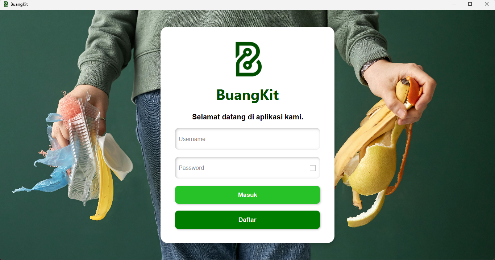

# project-BuangKit
BuangKit (Buang, Uang, Bangkit) adalah sebuah inovasi aplikasi dengan menerapkan sistem membuang sampah untuk mendapatkan uang dan bangkit dari bencana sampah pada era saat ini.

# Informasi Tim
Nama        : TAYI
Instansi    : Universitas Hasanuddin
Anggota     :
1. Yusra Erlangga Putra         H071231052 
2. Thahirah Awlyah Zahra        H071221073 
3. Muhammad Ikhsan Saputra      H071231083 
4. Rohsilia Gratia Simak        H071231087 

# Asisten Pendamping
Muhammad Thoriq Ali Said

# Tim Juri
1. Ihlasul Mufti Faqih 
2. Awang Mulya Nugrawan 

# Tema Aplikasi
Sustainability and Environment 

# Latar Belakang
Perkotaan menghadapi masalah serius terkait pengelolaan sampah. Peningkatan populasi dan konsumsi menyebabkan akumulasi sampah yang semakin tinggi. Pengelolaan sampah yang tidak efisien dapat mengakibatkan pencemaran lingkungan, kesehatan masyarakat, dan kerugian ekonomi. Masyarakat memerlukan solusi yang lebih efisien dan terintegrasi untuk mengatasi masalah sampah. Oleh sebab itu, kami berencana membuat aplikasi BuangKit (Buang, Uang, Bangkit).

# Solusi 
BuangKit (Buang, Uang, Bangkit) adalah sebuah inovasi aplikasi dengan menerapkan sistem membuang sampah untuk mendapatkan uang dan bangkit dari bencana sampah pada era saat ini. Aplikasi ini kami kembangkan untuk mengatasi masalah sampah di area perkotaan yang belum memiliki sistem pengelolaan sampah yang baik dengan memanfaatkan teknologi dan juga kerja sama dengan bank sampah terdekat. Aplikasi berguna untuk memberi informasi tentang sampah rumah tangga kepada pihak pengelola sampah. Salah satu fitur keunggulan aplikasi ini adalah pengguna dapat menukarkan sampah ke bank sampah terdekat dan akan mendapatkan poin reward yang dapat ditukarkan dengan uang.

# Fitur Aplikasi 
1.	Memiliki fitur login yang dapat menyimpan data dan riwayat User.
2.	Memiliki fitur register ketika User belum terdaftar dalam aplikasi.
3.	Dapat menampilkan riwayat penyetoran/pelaporan sampah.
4.	Dapat menampilkan informasi riwayat penyetoran secara lengkap seperti waktu, tempat, jenis sampah dan beratnya.
5.	Fitur reward poin yang didapatkan jika menyetorkan langsung sampah ke bank sampah terdekat.
6.	Fitur penukaran reward yang telah didapatkan dengan pulsa, listrik, hingga saldo bank.

# Penerapan Prinsip OOP 
1.	Pada MainPage.java yang merupakan interface terdapat metode abstrak initialize(). (abstraction)
2.	Pada RootPage.java dan ScenePage terdapat metode abstrak yang mengembalikan StackPane(root) dan mengembalikan Scene. (abstraction)
3.	Pada model Trash.java dan User.java memiliki atribut private (encapsulation) disertai metode setter dan getter, memiliki 2 constructor yang (overloading), Menggunakan StringProperty dan DoubleProperty dari JavaFX untuk properti yang mendukung binding, memfasilitasi perubahan data yang otomatis tercermin di UI (Property).
4.	Class DefaultPage.java, TrashPage.java, LoginPage.java dan RegisterPage.java mengimplemetasikan interface dari MainPage dan ScenePage (inheritance) dan mengaplikasikan fungsi bawaan dari interface (overriding). Instance dari class controller untuk menghubungkan scene dengan database sqlite dalam mengolah data.
5.	Pada DefaultPage.java juga memiliki subclass yang bertujuan untuk menghemat penggunaan kode yang sama pada suatu scene. Pada case yang didasarkan pada tombol yang ada di navigasi akan menginstance class dan akan memanggil sebuah root untuk mengganti beberapa elemen yang berbeda.
6.	Pada class RewardPoint.java menerapkan instance class Stage baru yang akan memunculkan Pop-up dan menerapkan konsep inheritance dari class Button bawaan dari javafx

# Link Repository GitHub Project
https://github.com/YusraEr/project-BuangKit.git

# Mentoring 
Muhammad Thoriq Ali Said – Rabu, 29 Mei 2024

# Demo Aplikasi
